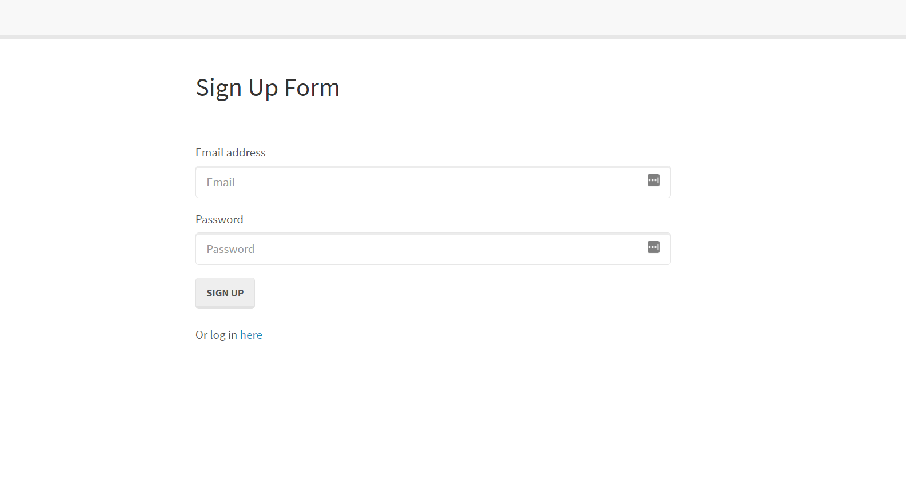
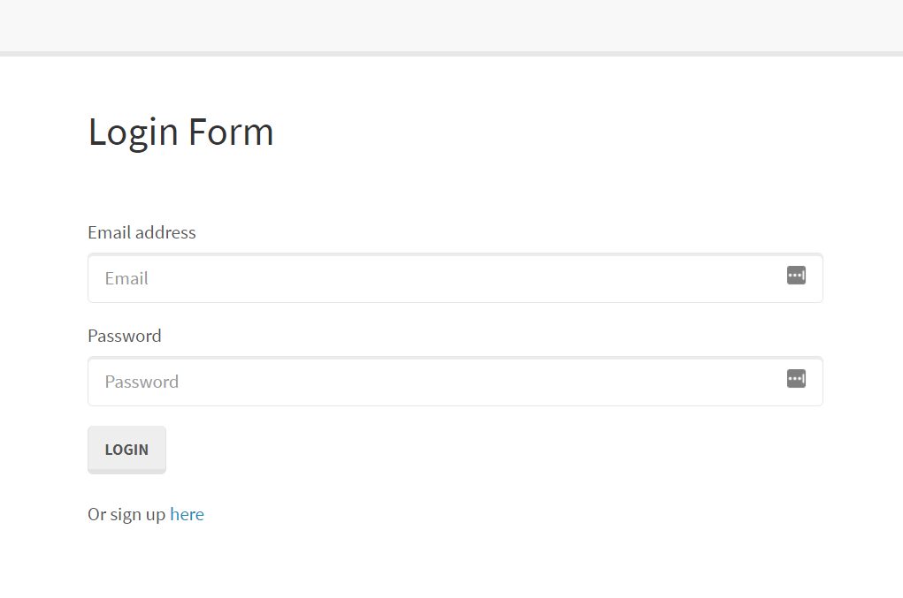
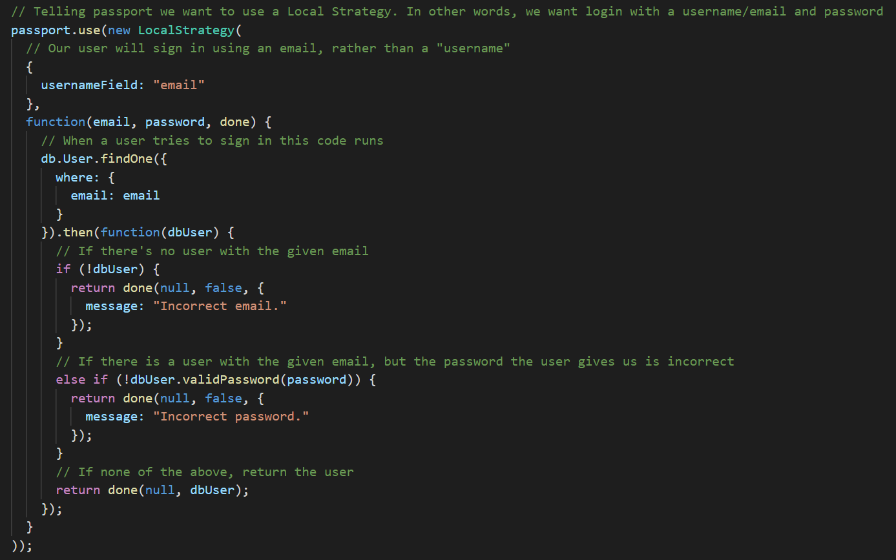
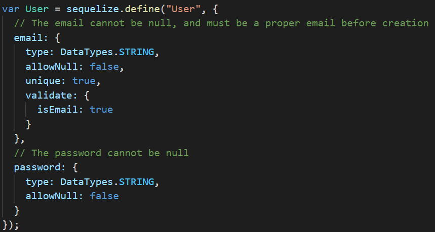
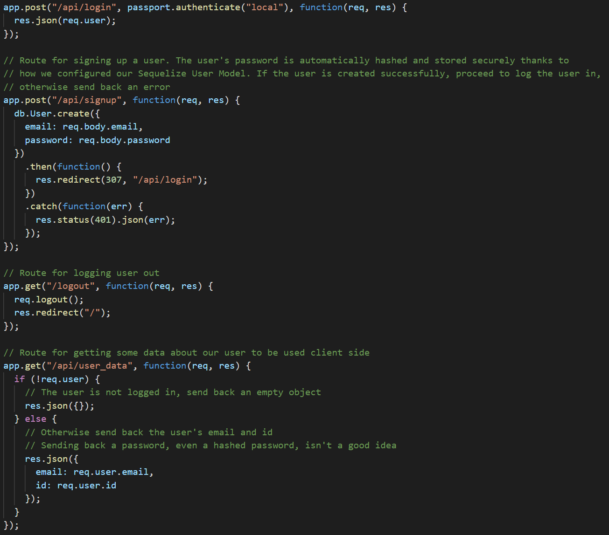
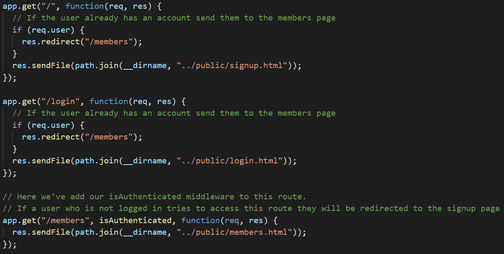

# program-detailing
Explaining, in detail, code for a project and how it functions.

## Table of Contents
* [Functionality](#functionality)
* [Explanation of Files](#explanation-of-files)
* [Config](#config)
* [Models](#models)
* [Public/JS](#public/js)
* [Routes](#routes)
* [Server.js](#server.js)
* [Author](#author)
* [Acknowledgments](#acknowledgments)
* [License](#license)

## Walkthrough

### Functionality
When opening the website, the user first comes across the sign up form page where they can enter an email address, password, and then click "Sign Up" in order to create an "account". The information used for the sign-up form can then be used in order to log in to the website where they will be greeted with a page stating "Welcome [your@email.com]". Inputting a password that was not provided for an account at sign-up will prevent the user from logging in by refreshing the input forms.

This program uses Sequelize and passport in order to recreate a log-in and sign-up page with user validation/authentication based on the password the user uses to sign-up for an account with. The data inputted by the user for the application is all stored in a database using MySQL. Using a database rather than local storage allows us to conceal sensitive user information. 

## Explanation of Files

### Config
#### isAuthenticated.js
This Javascript file located in the middleware folder in the config folder is responsible for directing the user based on whether or not they are logged in or not. If so, then the user is directed to the "logged in" page of the application but elsewise they are redirected to the login page where the input fields will be empty.

#### passport.js
The passport.js file inside the config folder is where much of the authentication occurs. The application requires an input of an email address from the user for sign up and checks for correct formatting of the user-input on the sign up screen. This file is then used to check if the username inputted on the log in screen exists in the database or not and if so, checks if the password for the username is correct. 

### Models
#### index.js
Connects to the user database and retrieves user information from the MySQL database using Sequelize. The database information is then exported from the file and used by the passport.js file.

#### user.js
Used to define the information within the database; the email and password. The email is required to be a string and to be formatted as an email and is validated as such. The password is also a string. Neither field can be left as null values. This file also uses bcrypt for password-hashing and hiding the password as the user inputs it. The user information is then returned from the file.

### Public/js
Contains HTML, CSS, and front-end Javascript files.
#### login.js
Retrieves and handles user-input on the log in page of the application. Links with the login.html file.

#### members.js
GETS which user is logged into the application and displays their username on the "logged in" screen.

#### signup.js
Retrieves and handles user-input on the sign up page of the application. Links with the signup.html file.

### Routes
#### api-routes.js
Uses passport.authenticate middleware to validate user input for log-in. Creates log for user information in the database based on information inputted on the sign up page.

#### html-routes.js
Sends user to "logged in" page if already logged in. Otherwise sets up routes to send users to the signup and login pages.

### server.js
Sets up the required packages for the application, uses routes, syncs database, and starts server on localhost.

## Author
Nathan Vu
* [Github](https://github.com/nathanmvu)
* [Email](mailto:nathanvu99@gmail.com)

## Acknowledgements
Application code provided by the UCB Extension Bootcamp

## License
GNU GPL v3.0

